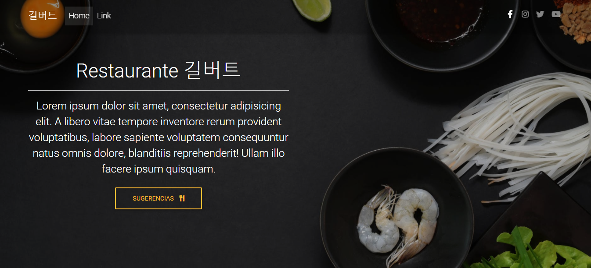
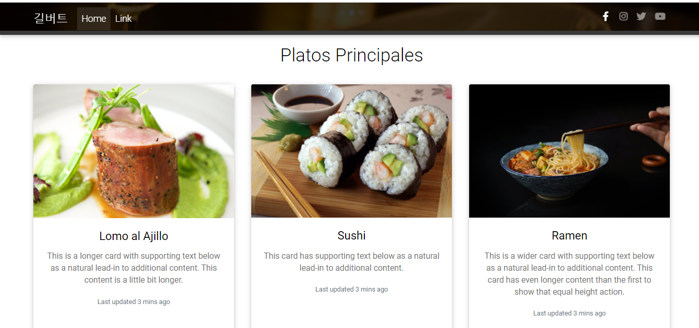
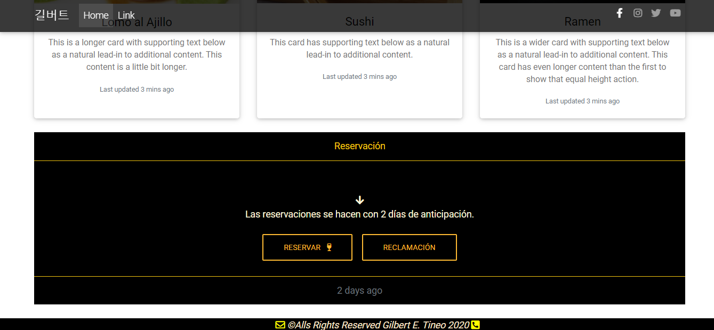

# Página Web Restaurante / Restaurant Website

Este proyecto es una Página Web 'Sencilla' orientado al formato de un Restaurante de manera Online,
en donde el Usuario podrá dar sugerencias ya sea acerca del lugar o la comida.
La página contiene un apartado en donde Muestra cuales son los Platos principales que ofrece
el Restaurante al igual que una sección para poder hacer una reservación y una Área de reclamación. 

This project is a 'Simple' Web Page oriented to the format of a Restaurant in an Online way,
where the User can give suggestions either about the place or the food.
The page contains a section where it shows which are the main dishes it offers
the Restaurant as well as a section to make a reservation and a claim area.

### Herramientas Utilizadas / Used Tools

- MDBootstrap :art:
- SweetAlert2 :art:

